## Disclaimer

The following work was done using virutal machines and a fake social media website. The exploits shown here should never be used against a website you do not have permission to modify or test (also, this vulnerability is addressed on pretty much any website).

# Introduction

This lab is dedicated to demonstrating an SQL injection attack on a vulnerable web application. To do so, I will be playing two roles: The attacker, and the defender. As the attacker, I will be looking for ways to exploit SQL injection vulnerabilities and recording the damage I can do to the application. As the defender, I will be looking for ways to secure the application to defend against SQL injection attacks.

# Procedure

## Initial Setup

I begin by setting up my lab environment. Following the procedures in previous labs, I launch the Labtainer exercise and am met with the initial screens.

-_Figure 1_: The windows that follow the lab’s launch. On the left, there are two command terminal windows. The top one is connected to the server, and the bottom one to the client. To the right is a Firefox window with two input prompts.

  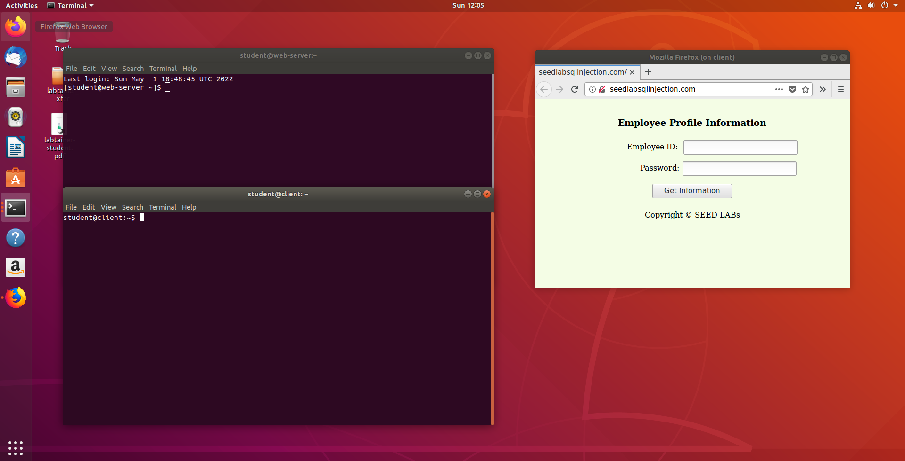

## MySQL Console

In this task, I familiarize myself with SQL commands by playing around with the provided database. To begin, I access the terminal for the server and enter the command provided (shown in _Figure 2_) to logon to the server’s “root” account.

-_Figure 2_: The server terminal and my login command (second line). This command logs me into the MySQL console with the username “root” (the root account) and password “pseedubuntu”. After doing so, I am granted access and welcomed with the information shown below.

  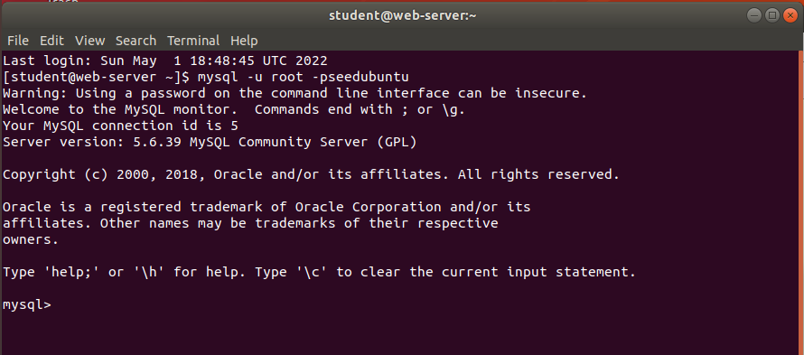

Next, I must load in the pre-existing “Users” database. I use the command “use Users” to load up the database, and “show tables” to show its tables.

-_Figure 3_: Accessing the “Users” database and showing its tables. Note that the error in the center comes from me not ending a command with a semicolon. It appears that the database is currently a 1 x 1 table.

  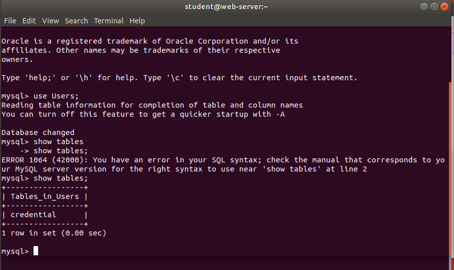

## SQL Injection Attack on SELECT Statement

For the most part, SQL injections are launched by using a developer’s input prompts against them. Similarly, I will be using the prompts in the Firefox window to inject my own SQL code so that I can log into the application without needing any employee credentials. The directions provide a snippet of the application’s code to show how users are authenticated. Analysis indicates that this application is using a classic—and very vulnerable—form of authentication in which the user’s inputs are compared to a database of valid employee IDs and passwords. If a match between input and valid credentials is found, the user is granted access. It is through this piece of architecture I will be launching my SQL attack.

My interpretation is that a bulk of SQL injections occur because of a fatal flaw in the code’s logic. When a code compares something, there is another variable, such as a Boolean, that determines whether access will be granted. That is, if there is a match found between a user’s input and credentials in the database, this variable is returned “true,” and the user is granted access. However, if an attacker were to take a step back and look at things in a broader perspective, all that he needs to gain access is to make this variable return “true” which can be done by providing a statement that any system can deem “true” (such as 1 = 1). Additionally, adding a double dash (--) or number sign (#) at the end of the statement comments out all following code so that only the true statement is left. This is the logic I will be following for my attack.

## SQL Injection Attack from Webpage

My provided code shows that there is a line that essentially says if the user’s name is “admin”, and the correct password is provided, all employee information will be returned. If I know that the username for the admin is “admin”, and that the site has the vulnerability I mentioned above, then adding ”  ‘ or name = ‘admin’#;  “ to the “Employee ID” field should grant me administrator access to the database.

-_Figure 4_: My SQL code injection. The single quote at the beginning closes the string field (the expected input) and allows all following inputs to be interpreted as SQL commands. The “or” statement injects the phrase “name = ‘admin’”. This is to exploit the code’s specification that the user with the name “admin” should be granted full access to the database. The number sign comments out any following code so that only the true statement is left. Finally, the semicolon concludes the command since MySQL requires commands to end with semicolons.

  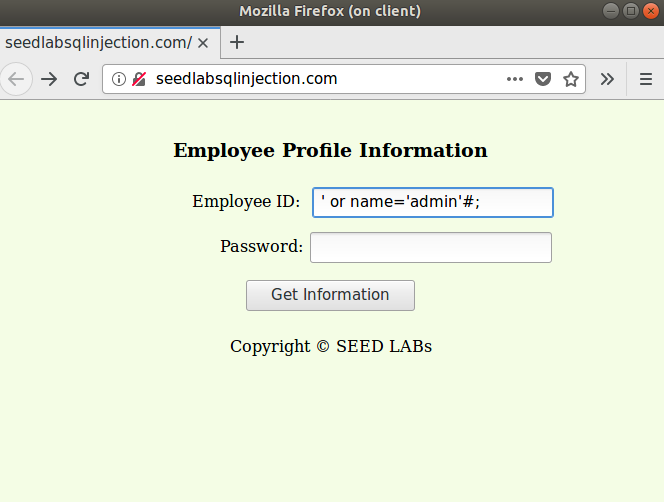

The following is the result after hitting “Get Information”.

-_Figure 5_: The result of entering my query with the SQL injection. Notice that all employee information is displayed which means that I am viewing the database as the administrator. This means that my SQL injection was a success.

  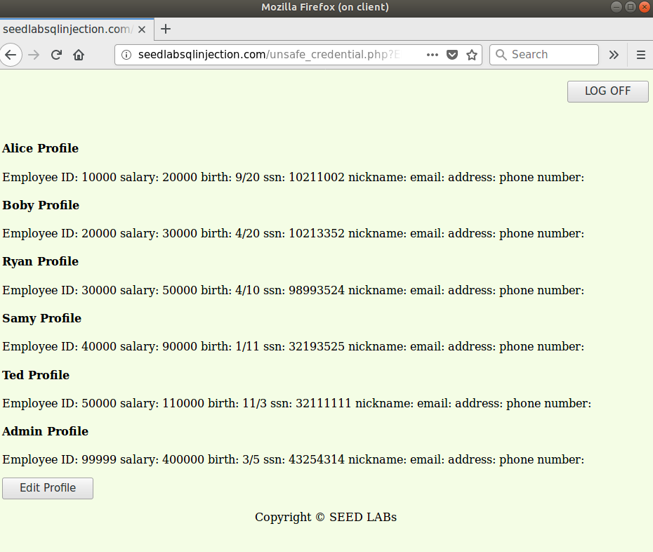

## SQL Injection Attack from Command Line

I will now be doing the same attack, except I will only be using the client’s command terminal. To do so, I will be using the built-in “curl” tool to send an HTTP request for the database’s webpage while appending my code for the SQL injection. The only difference here is that I must be mindful of how the HTTP request encodes special characters. Using the URL I was given after being granted access in the previous step, I reverse-engineer the following curl command:

Figure 6: The HTTP curl command I entered in the client terminal. Notice that the code for the SQL injection is similar, except the special characters (‘, =, and #) have been encoded for the HTTP format.

  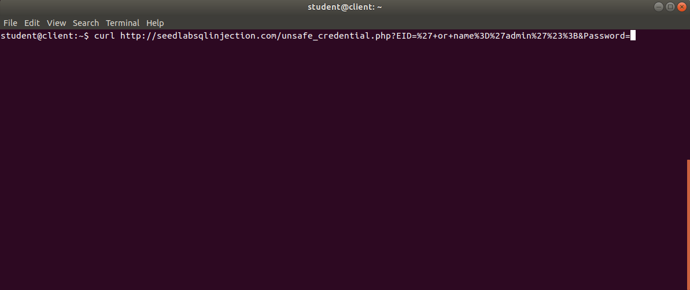

The following are the results:

-_Figure 7_: The result of entering the curl command. I am given the HTML code for the page the admin sees after logging in. Embedded in the middle is the information for all employees.

  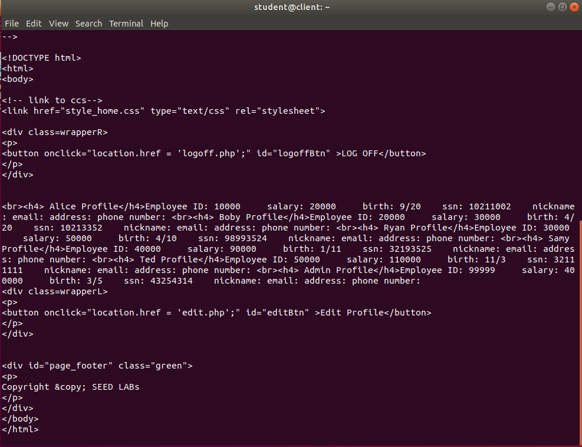

## Append a New SQL Statement

The injection above shows how I can steal information, but now I will explain how I could run two commands to access the database and modify it. The directions say this is not possible; but if it was, I would first apply an always true statement (such as 1=1) followed by a semicolon to mark the end of the line, then whatever modification command I want to apply to the database. An example of this would be: 

‘ or 1=1; UPDATE Users SET Salary = ‘500000’ WHERE name = Ted;#

As mentioned, first there is the always true statement followed by a semicolon to end the line, then the command for my second line. In this case, I want to update the “Users” database so that Ted’s salary will be $500,000.  Another semicolon then marks the end of this line, and the number sign comments out any following code.

## SQL Injection Attack on UPDATE Statement

Stealing a database’s information is one thing, but modifying it is more severe. In this task, I will be performing SQL injections that will modify the information in the database.

## SQL Injection Attack on UPDATE Statement

For this task, I will be acting as a malicious employee (in this case, as Alice) who wants to increase her salary shown in the database. As the directions show, there is an edit page for user information, but only the administrator can edit salary values.

I begin by accessing the “edit.php” page on the website and making sure I am logged in as the administrator. Since I am Alice, a malicious employee, it follows that I would know how to log in as the administrator. Next, I inject my SQL code.

-_Figure 8_: A portion of my SQL injection. The full statement is, (minus double quotes) “ ‘, salary=’100000’ where eid =’10000’ “.

  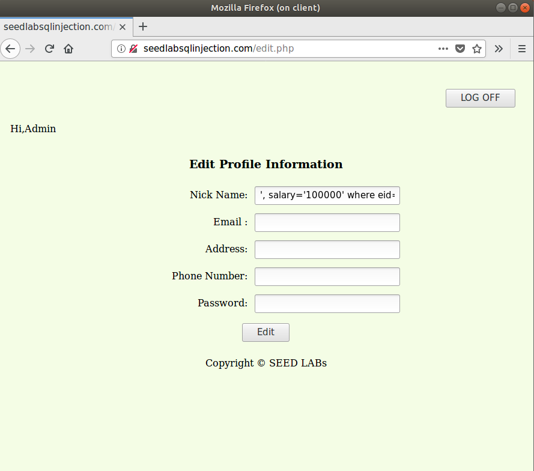

This statement should modify Alice’s salary so that it displays “100000” instead of “20000”. Sure enough, the admin’s page following the code injection shows this.

-_Figure 9_: The administrator’s home page after the edit. Notice that the salary for Alice now reads “100000” instead of the previous “20000”.

  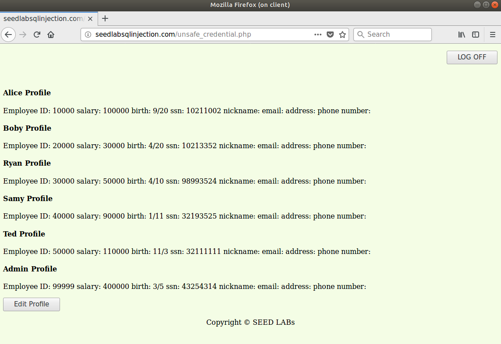

## SQL Injection Attack on UPDATE Statement -- Modify Other People's Password

Following the same principle, I will now be using the UPDATE statement to change another user’s password. In this case, as Alice, I want to change Boby’s password to “alicerulz”. The command for doing so is the same as the previous one except I am editing the password field and the EID will be set to Boby’s.

-_Figure 10_: Injecting the SQL code to edit Boby’s password. The full command reads (minus double quotes), “ ‘, Password=’[SHA1 hash value for “alicerulz”] WHERE eid=’20000’;# “.

  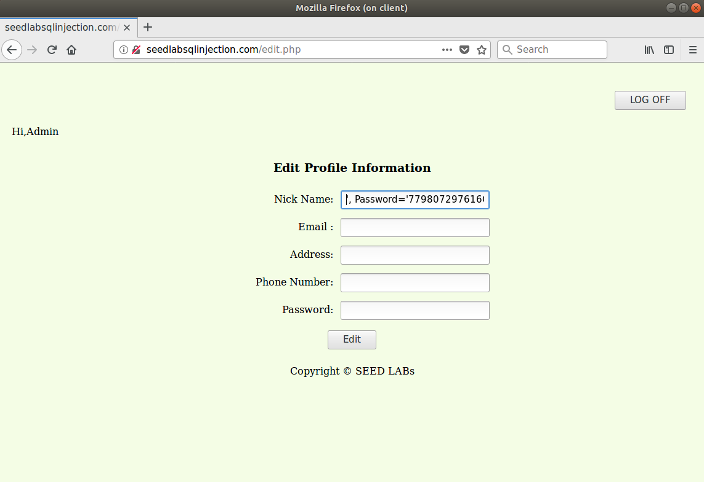

After entering this, I then log out and sign in with Boby’s employee ID. However, instead of his normal password, I will type “alicerulz” into the password field. I am then taken to Boby’s information page.

-_Figure 11_: Boby’s information page. I have logged in using his employee ID and the password “alicerulz”.

  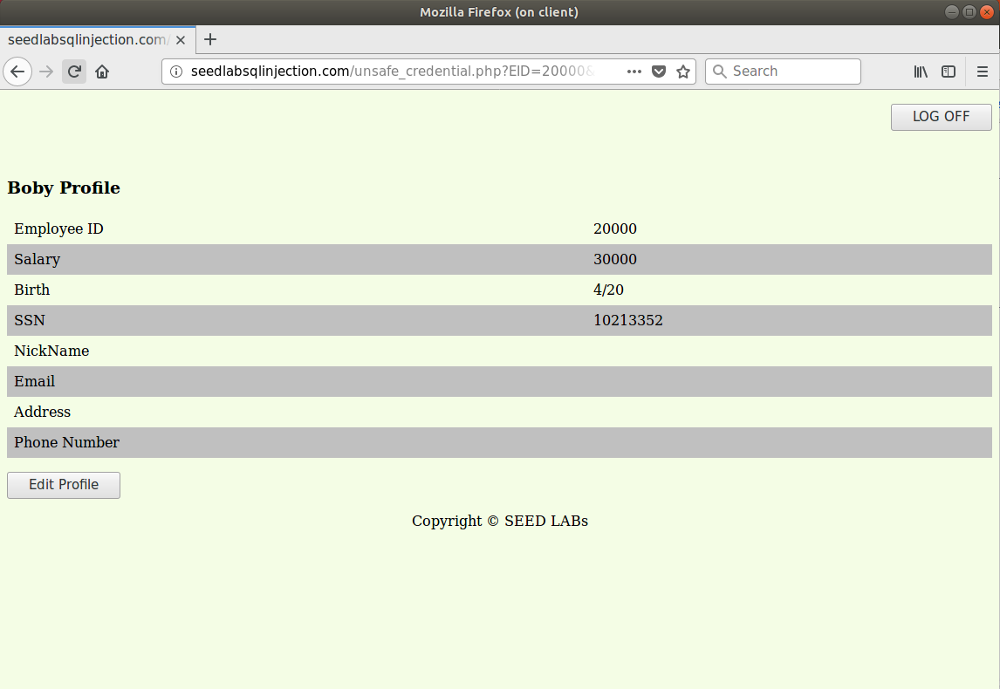

# Countermeasure -- Prepared Statement

Now I will be switching roles. Instead of attacking the database, I will be trying to defend it. I will begin by addressing one of the fundamental flaws of a webpage which is interpreting input data as code. To prevent this, I will be using a prepared statement to ensure that the boundary between code and data remains in place during communications with the database.

## Identifying the Vulnerability for Authentication

I begin by going to the server terminal and navigating to “/var/www/seedlabsqlinjection.com/public_html/ and locating the .php files for the application. Since this subtask is addressing authentication, I use vim to open the “unsafe_credentials.php” file.

-_Figure 12_: The snippet of “unsafe_credentials.php” that contains the SQL injection vulnerability. Notice that the user’s inputs are assigned to variables which are then used as code in the lower half of the snippet. 

  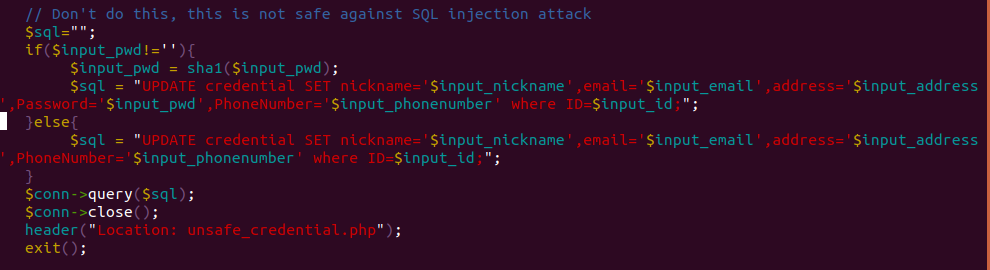

As mentioned, this is a classic vulnerability of user input (data) treated as code. The solution here is to create a prepared query statement and bind the variables storing user input to parameters for that statement.

## Identifying the Vulnerability for Profile Editing

On the server terminal, navigating to the public_html directory shows me the .php files for the application. Using vim, I open the “unsafe_edit.php” file and view its contents.

-_Figure 13_: The contents of the “unsafe_edit.php” file. As the comment indicates, the following code is vulnerable to SQL injection attacks.

  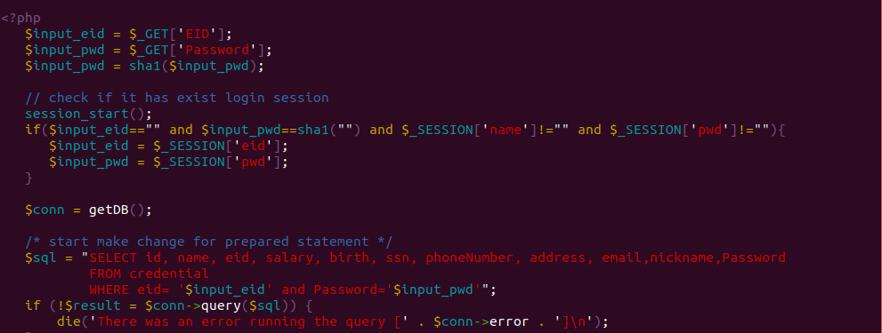

# Conclusion

In this lab, I performed further analysis of SQL injection attacks and gained some insight of these attacks from the perspectives of both the attacker and defender. From this lab, I conclude that SQL injection vulnerabilities come primarily from data being used as code, and that the best way to prevent this is to create prepared statements that accept parameters which are created with the user’s input. In doing so, you can ensure that any input, including injected code, goes into the statement which prevents any direct access or modifications to the database. Since SQL injections are incredibly common, I believe this lab is definitely relevant to real-world cybersecurity and makes an important point that any web or application developer should observe. 
